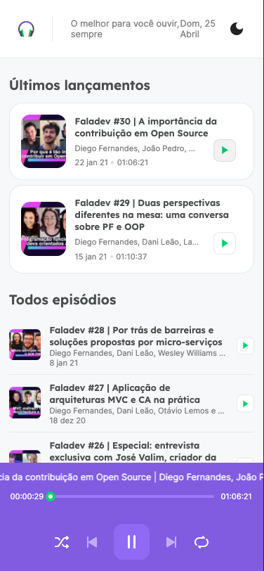

# Podcastr

 
"App web desenvolvido durante a NLW 5 organizado pela RocketSeat."
 
Podcastr é um sistema web desenvolvido para listar podcasts e ouvi-los diretamente no site.
 
Desenvolvido usando React + Next + Typescript + JSON Server para exibir os dados em desenvolvimento.
 

## Comandos

 
git clone https://github.com/joonatassouza/podcastr.git
 
cd podcastr
 
yarn ou npm install
 
yarn server ou npm run server // para executar o servidor
 
Em outra aba execute
 
yarn dev ou npm run dev // para executar o projeto
 
Abra no navegador [https://localhost:3000](https://localhost:3000)
 
 

### Build

 
yarn server ou npm run server // para deixar o server rodando
 
yarn build ou npm run build // para gerar a build
 
yarn start ou npm run start // para executar a build de produção

## Tema claro e escuro

## Responsivo

| Home                                          | Home Tocando                                          | Detalhes do podcast                            |
| --------------------------------------------- | ----------------------------------------------------- | ---------------------------------------------- |
|  |  |  |
